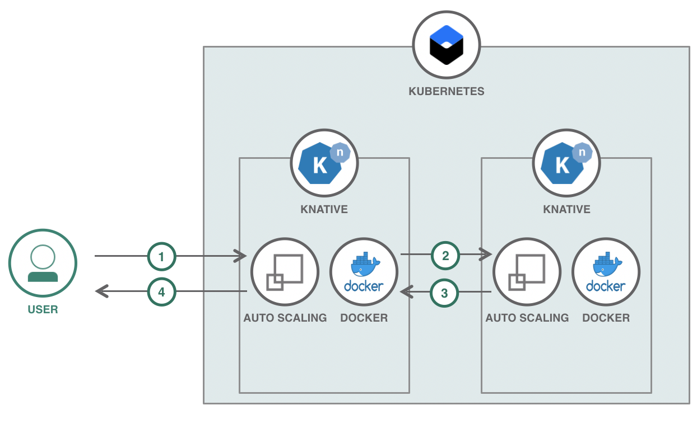

[](https://travis-ci.com/IBM/knative-serverless)

# Knative Serverless Web Application

In this Code Pattern, we will create a travel web application using Node.js, React, and Knative. This travel application is a part of the [Bee Travels](https://github.com/bee-travels) project that focuses on deploying and managing the destinations microservice and UI on Knative as a completely serverless application.

# Architecture



1. User interacts with the app UI to search/view destination data. In interacting with the UI, the autoscaling of Knative serving is triggered for the UI.
2. The app UI makes calls to the destination service APIs to get destination data. With the API calls, the autoscaling of Knative serving is triggered for the destination microservice.
3. The necessary destination data is sent from the APIs to the UI.
4. The UI displays the data from the APIs to the user.

# Steps

Follow these steps to setup and run this code pattern locally as well as on Knative. The steps are described in detail below.

1. [Prerequisites](#1-prerequisites)
2. [Clone the repo](#2-clone-the-repo)
3. [Run the application](#3-run-the-application)
4. [Deploy to Knative](#4-deploy-to-knative)

## 1. Prerequisites

* [IBM Cloud account](https://cloud.ibm.com/registration)
* [IBM Cloud CLI](https://cloud.ibm.com/docs/cli?topic=cloud-cli-ibmcloud-cli&locale=en-US#overview)
* [Docker](https://www.docker.com/products/docker-desktop)

For running these services locally, the following will be needed:

* [NodeJS](https://nodejs.org/en/download/)
* [NPM](https://www.npmjs.com/get-npm)

## 2. Clone the repo

Clone the `knative-serverless` repo locally. In a terminal, run:

```bash
git clone https://github.com/IBM/knative-serverless
cd knative-serverless
```

## 3. Run the application

Run `npm install` and `npm start` from both the `/src/destination` and `/src/ui` directories. In a browser, go to `localhost:3000` to interact with the UI and `localhost:4000` to interact with the destination service APIs in the swagger.

## 4. Deploy to Knative

1. Provision the [IBM Cloud Kubernetes Service](https://cloud.ibm.com/kubernetes/catalog/cluster) and follow the set of instructions for creating a Container and `Standard` Cluster.
> NOTE: This step can take about 30 minutes

2. To allow changes to the Destinations Service or the UI, create a repo on [Docker Hub](https://hub.docker.com/) where the new modified containers will be pushed to.
> NOTE: If a new repo is used for the Docker containers, the container `image` will need to be modified to the name of the new repo used in [destination-knative-service.yml](destination-knative-service.yml) and/or [ui-knative-service.yml](ui-knative-service.yml).

```bash
export DOCKERHUB_USERNAME=<your-dockerhub-username>

docker build -t $DOCKERHUB_USERNAME/destination:v0.0.2 destination/
docker build -t $DOCKERHUB_USERNAME/bee-ui:v0.0.8 ui/

docker login

docker push $DOCKERHUB_USERNAME/destination:v0.0.2
docker push $DOCKERHUB_USERNAME/bee-ui:v0.0.8
```

3. From your newly created cluster dashboard, click on `Add-ons` and install `Managed Knative`

4. Login to the IBM Cloud using the [Developer Tools CLI](https://www.ibm.com/cloud/cli):
> NOTE use `--sso` if you have a single sign on account, or delete for username/password login

```bash
ibmcloud login --sso
```

* Set the Kubernetes environment to work with your cluster:

```bash
ibmcloud cs cluster-config $CLUSTER_NAME
```

The output of this command will contain a KUBECONFIG environment variable that must be exported in order to set the context. Copy and paste the output in the terminal window. An example is:

```bash
export KUBECONFIG=/home/rak/.bluemix/plugins/container-service/clusters/Kate/kube-config-prod-dal10-<cluster_name>.yml
```

5. To deploy the services to Knative, run:

```bash
kubectl apply -f destination-knative-service.yml
kubectl apply -f ui-knative-service.yml
```

6. In a terminal window, run `kubectl get pods -w`. We will be watching the autoscaling feature of Knative serving. Initially, pods for both the destinations microservice and UI will be created. You can access the UI by going to `bee-kn-default.<INGRESS-SUBDOMAIN>` and the swagger for the destination APIs by going to `e`. After a few minutes with no activity, the pods will terminate and scale down to zero and you should see this in your terminal window. Once scaled down to zero, interact with the UI. You will notice that initially this will be very slow. This is because the containers are being created and scaling up to 1 pod each. Once created, if you interact with the UI again, you will notice that it runs smoothly. Here are some example logs of what to expect:

```bash
$ kubectl get pods -w
NAME                                               READY   STATUS    RESTARTS   AGE
bee-kn-frq55-deployment-6f9b5bd55d-x7zp5           2/2     Running   0          33s
destination-kn-fln2s-deployment-696b84bcc6-j7229   2/2     Running   0          40s
NAME                                               READY   STATUS        RESTARTS   AGE
destination-kn-fln2s-deployment-696b84bcc6-j7229   2/2     Terminating   0          2m47s
bee-kn-frq55-deployment-6f9b5bd55d-x7zp5           2/2     Terminating   0          2m42s
destination-kn-fln2s-deployment-696b84bcc6-j7229   0/2     Terminating   0          3m9s
destination-kn-fln2s-deployment-696b84bcc6-j7229   0/2     Terminating   0          3m9s
destination-kn-fln2s-deployment-696b84bcc6-j7229   0/2     Terminating   0          3m20s
destination-kn-fln2s-deployment-696b84bcc6-j7229   0/2     Terminating   0          3m20s
bee-kn-frq55-deployment-6f9b5bd55d-x7zp5           0/2     Terminating   0          7m43s
bee-kn-frq55-deployment-6f9b5bd55d-x7zp5           0/2     Terminating   0          7m43s
bee-kn-frq55-deployment-6f9b5bd55d-x7zp5           0/2     Terminating   0          7m44s
bee-kn-frq55-deployment-6f9b5bd55d-x7zp5           0/2     Terminating   0          7m44s
bee-kn-frq55-deployment-6f9b5bd55d-ct76c           0/2     Pending       0          0s
bee-kn-frq55-deployment-6f9b5bd55d-ct76c           0/2     Pending       0          0s
bee-kn-frq55-deployment-6f9b5bd55d-ct76c           0/2     ContainerCreating   0          0s
bee-kn-frq55-deployment-6f9b5bd55d-ct76c           1/2     Running             0          6s
bee-kn-frq55-deployment-6f9b5bd55d-ct76c           2/2     Running             0          7s
destination-kn-fln2s-deployment-696b84bcc6-qmnzp   0/2     Pending             0          0s
destination-kn-fln2s-deployment-696b84bcc6-qmnzp   0/2     Pending             0          0s
destination-kn-fln2s-deployment-696b84bcc6-qmnzp   0/2     ContainerCreating   0          0s
destination-kn-fln2s-deployment-696b84bcc6-qmnzp   1/2     Running             0          7s
destination-kn-fln2s-deployment-696b84bcc6-qmnzp   2/2     Running             0          9s
destination-kn-fln2s-deployment-696b84bcc6-qmnzp   2/2     Terminating         0          109s
bee-kn-frq55-deployment-6f9b5bd55d-ct76c           2/2     Terminating         0          2m7s
destination-kn-fln2s-deployment-696b84bcc6-qmnzp   0/2     Terminating         0          2m11s
destination-kn-fln2s-deployment-696b84bcc6-qmnzp   0/2     Terminating         0          2m12s
destination-kn-fln2s-deployment-696b84bcc6-qmnzp   0/2     Terminating         0          2m12s
bee-kn-frq55-deployment-6f9b5bd55d-ct76c           0/2     Terminating         0          7m8s
bee-kn-frq55-deployment-6f9b5bd55d-ct76c           0/2     Terminating         0          7m8s
bee-kn-frq55-deployment-6f9b5bd55d-ct76c           0/2     Terminating         0          7m9s
bee-kn-frq55-deployment-6f9b5bd55d-ct76c           0/2     Terminating         0          7m16s
bee-kn-frq55-deployment-6f9b5bd55d-ct76c           0/2     Terminating         0          7m16s
```

# License

This code pattern is licensed under the Apache License, Version 2. Separate third-party code objects invoked within this code pattern are licensed by their respective providers pursuant to their own separate licenses. Contributions are subject to the [Developer Certificate of Origin, Version 1.1](https://developercertificate.org/) and the [Apache License, Version 2](https://www.apache.org/licenses/LICENSE-2.0.txt).

[Apache License FAQ](https://www.apache.org/foundation/license-faq.html#WhatDoesItMEAN)